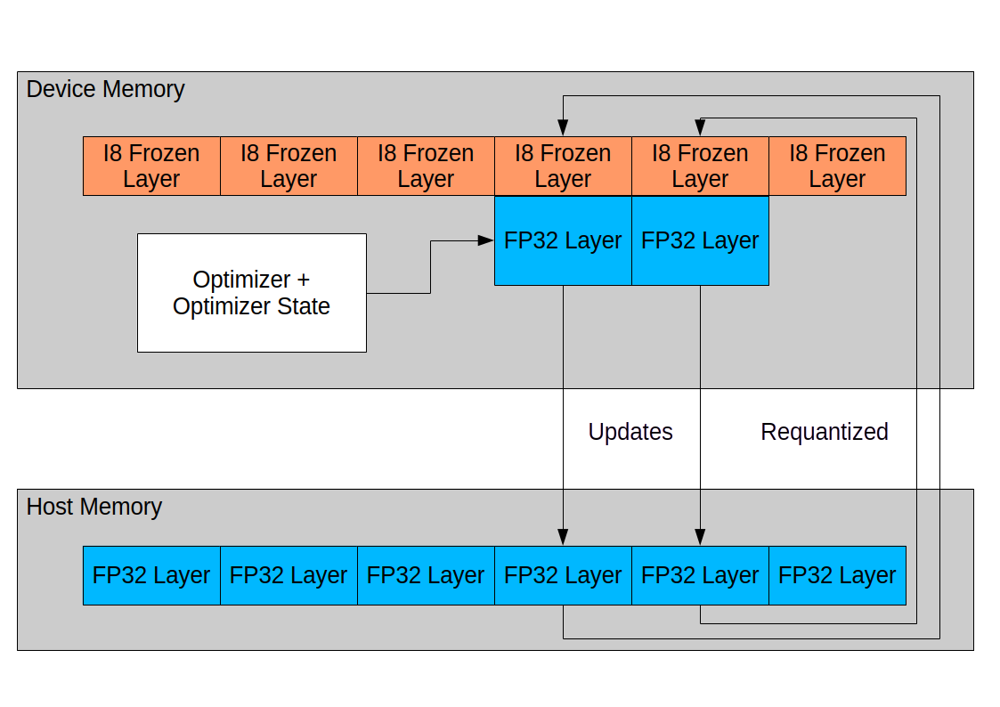

# QRotaryTraining: Efficient Full Training of Quantized LLMs

This repository contains a novel method for fully training all parameters of large language models (LLMs) while using less device memory than traditional methods.

## Method

The method provided involves creating a copy of the model, quantizing it to i8 precision, and loading it into device memory. Meanwhile, a copy in fp32 precision is kept in host memory. A small subset of layers is then loaded from host to device memory and trained for a set of optimization steps. Upon completion of the set steps, the delta of the weights is flushed out to host memory, and the layer is re-quantized. Using this method, device memory usage of as little as 2 bytes per parameter can be achieved. The development setup is a dual MI100 machine, which allows training of models up to 30B parameters.

## Usage

1. First, install the dependencies of QRotaryTraining:
    * `pip install -r requirements`
2. Subsequently, use `train_dynamic.py` as the entry point.
3. Choose parameters for `train_dynamic.py` by looking at `train_dynamic.py --help`
    * See `tune.sh` for an example configuration that trains LLaMA-7B on Alpaca

## Future Improvements

* Currently, the code is less efficient than it could be, as no quantized matmul shader with forward and backward implementation with good performance on Radeon Instinct hardware was available. For this reason, tensors are de-quantized on the fly, and fp16 matmul via rocblas is used.
* Several of the data loaders provided in `datamodules.py` are inefficient.
* This method is currently incompatible with DDP and FSDP parallelization methods. Multiple GPUs cannot be used besides via naive pipeline parallelism.

## License

All code in this repository is licensed under GPLv3, except where stated otherwise in the file.
